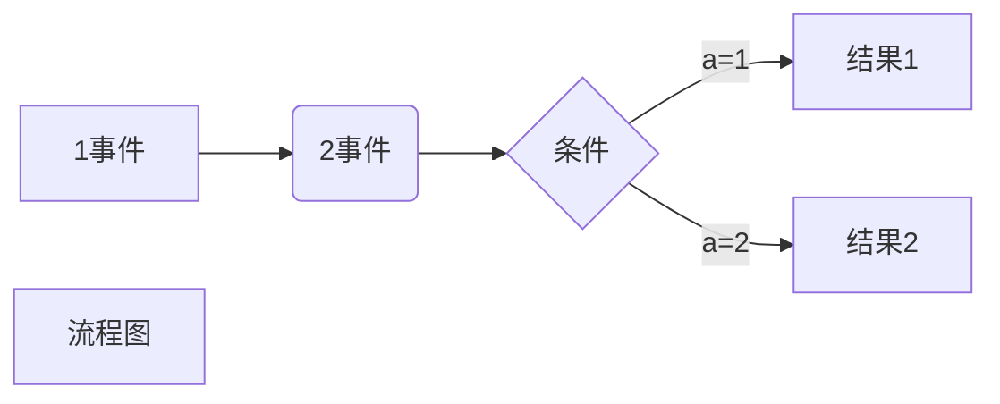

# markdown

## 语法

### 1.标题

```
标题用#表示

# 一级标题
## 二级标题
### 三级标题
#### 四级标题
##### 五级标题
###### 六级标题
```


# 实例：一级标题

## 二级标题
### 三级标题
#### 四级标题
##### 五级标题
###### 六级标题

### 2.段落

```
换行：空格和回车
```


### 3.字体

```
*斜体*
**粗体**
***粗斜体***
```

<font color=red size=5>如下</font>

*斜体*
**粗体**
***粗斜体***

### 4.分隔线

```
这样子：***或---
```

例：

---

***

### 5.引用

```
>引用
```

> 引用
>
> > 引用
> >
> > > 引用

### 6.删除线

```
~~删除线~~
```

例：~~嚣张哈哈哈哈哈哈哈~~

说实话我也不知道删除线有什么用处。。。。

### 7.代码

似乎这个用的比较多

```
​```生成代码块
```

### 8.链接和图片

```
链接和图片比较相似
链接：[名称](地址)
图片
图片可以贴网上的和本地的
```

例：

[我的GitHub](https://github.com/IronMan2002/IronMan2002.github.io)


### 9.表格

```
|  表头   | 表头  |
|  ----  | ----  |
| 单元格  | 单元格 |
| 单元格  | 单元格 |
```

| 表头   | 表头   |
| ------ | ------ |
| 单元格 | 单元格 |
| 单元格 | 单元格 |

似乎是这样，，但还是好难记啊，，为什么不右键呢（逃


## 一些进阶（并没有）的用法

### 今天多学了一个：画流程图

```
语法：
graph LR
A[1事件] -->B(2事件)
    B --> C{条件}
    C --> |a=1| D[结果1]
    C --> |a=2| E[结果2]
    F[流程图]
```

例：



```
基本的规则就是在mermaid中创建模块，-->表示箭头连接。[表示方块]，(表示圆角)，{表示判断的菱形}
```

